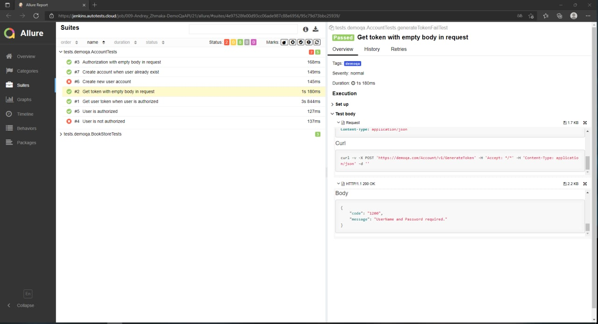
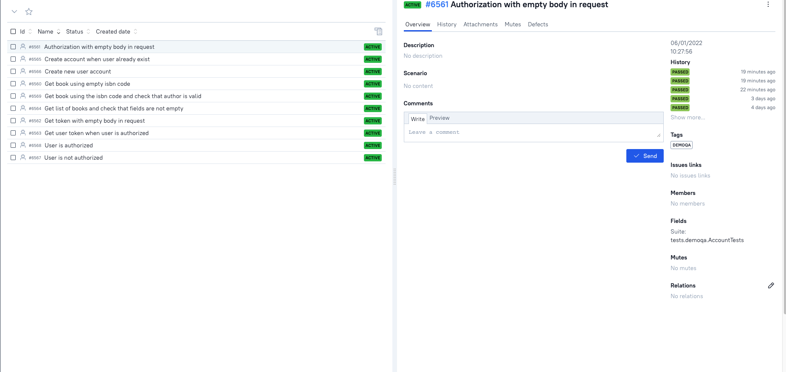

# Автотесты API для сайта https://demoqa.com

___

## Используемые технологии и инструменты

<code></code>
<code></code>
<code></code>
<code></code>
<code></code>
<code></code>
<code></code>
<code></code>
</p>

___

## Инструкция по запуску тестов

Запуск тестов происходит через джобу в [Jenkins](https://jenkins.autotests.cloud/job/009-Andrey_Zhmaka-DemoQaAPI/)


### Serve report:

```bash
allure serve build/allure-results
```

## Оповещение о результатах прохождения тестов через бот в телеграмм


## Анализ результатов

Более подробно с результатми тестов можно ознакомиться в:

* Jenkins через Allure Reports или Allure TestOps

### Анализ результатов в Jenkins через Allure Reports




### Анализ результатов в Allure TestOps




